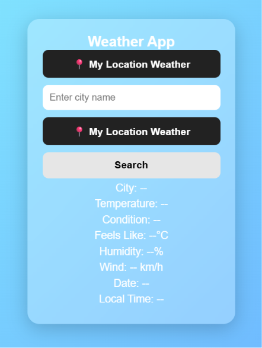

# 🧮 Pro Calculator

A modern calculator built using HTML, CSS, and JavaScript.

## 🚀 Features

---

## 📸 Screenshot

---

## 🚀 Live Demo

[View Calculator]( https://abhi12012.github.io/Calculator-App-Beginner-Pro-/)

### Basic Calculator Operations

* Addition (+)
* Subtraction (-)
* Multiplication (*)
* Division (/)

### Memory Functions

* MC (Memory Clear)
* MR (Memory Recall)
* M+ (Memory Add)
* M- (Memory Subtract)

### History System

* Stores calculation history
* Displays previous calculations
* Clear history option

### Theme Toggle

* Dark Mode
* Light Mode

### Additional Features

* Delete Last Character (DEL)
* Clear Display (C)
* Error Handling
* Responsive Grid Layout

---

## 🛠 Technologies Used

* HTML5
* CSS3
* JavaScript (Vanilla JS)

---

## 📂 Project Structure

calculator-app/

├── index.html

├── style.css

├── script.js

└── README.md

---

## ⚙️ How It Works

1. Enter numbers using the calculator buttons.
2. Select an operator (+, -, *, /).
3. Press "=" to calculate the result.
4. Results are displayed on the screen.
5. Every successful calculation is saved in History.
6. Memory buttons allow storing and recalling values.

---

## 💾 Memory Buttons

| Button | Description                        |
| ------ | ---------------------------------- |
| MC     | Clear memory                       |
| MR     | Recall memory value                |
| M+     | Add current value to memory        |
| M-     | Subtract current value from memory |

---

## 📜 History Example

10 + 20 = 30

50 - 15 = 35

7 * 8 = 56

---

## 🛡 Error Handling

The calculator handles:

* Invalid expressions
* Empty calculations
* NaN results
* Runtime calculation errors

---

## 📚 Concepts Practiced

This project helped me learn:

* DOM Manipulation
* JavaScript Functions
* Arrays
* Event Handling
* CSS Grid
* Theme Switching
* Error Handling
* Git & GitHub Workflow

---

## 🔮 Future Improvements

* Keyboard Support
* Scientific Calculator Functions
* Local Storage History
* Percentage Button
* Square Root Function
* Mobile Optimization

---

## 👨‍💻 Author

Abhishek Bansal

Learning Web Development Step by Step 🚀
